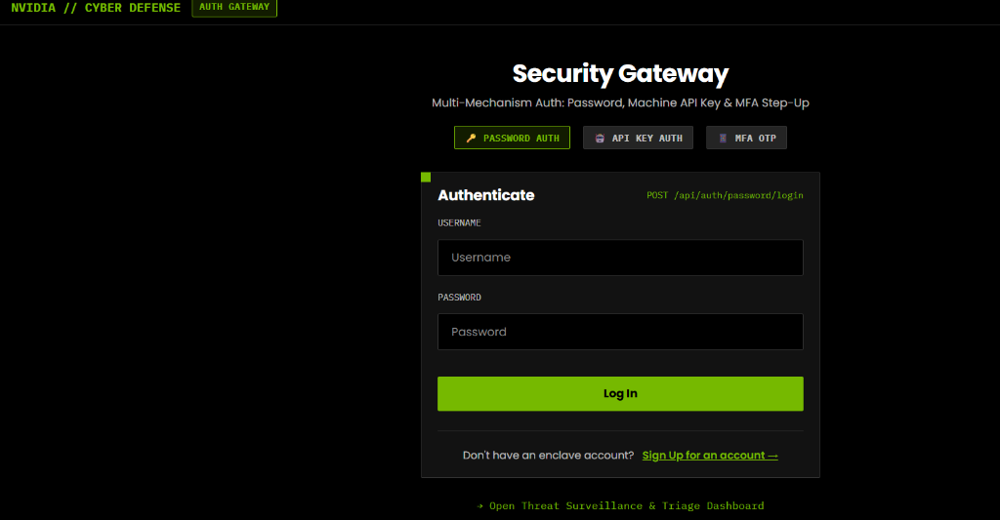
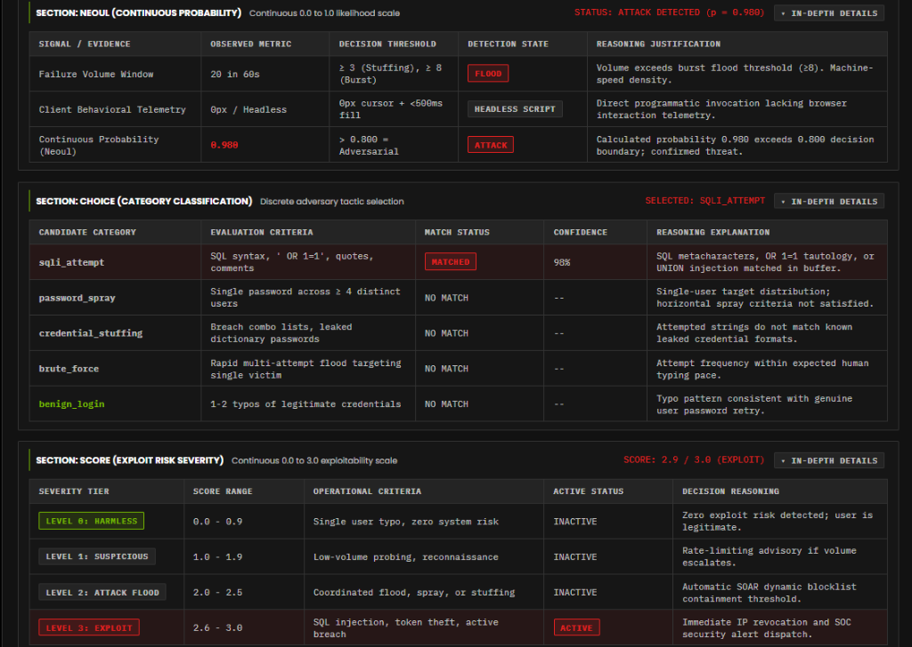

# NVIDIA Cyber Command

An attack simulation and automated defense system that compares remote cloud AI with a local edge model on live credential attacks.

Most security dashboards tell you that you were attacked half an hour after it happened. This system cuts the delay. It runs incoming requests through client telemetry, scores the traffic with two different AI models, and automatically blocks attacking IP addresses in less than one millisecond.


---

## What SOAR stands for

SOAR stands for **Security Orchestration, Automation, and Response**.

Traditional setups treat monitoring and mitigation as separate jobs. An alert fires, a ticket opens, and an engineer reviews the log whenever they get to it.

SOAR combines those three steps into code:

1. **Security Orchestration.** It ties together the Express login gateway, the audit log collector, the AI triage models, and the network blocklist into one pipeline.
2. **Automation.** Instead of asking a human to inspect IP history, the server triggers an evaluation playbook as soon as traffic spikes or suspicious payloads appear.
3. **Response.** If confidence crosses 90%, the backend writes the IP to a blocklist with a 15-minute expiration time. The next request from that address receives an immediate `403 Forbidden` response. No human intervention needed.

---

## System architecture

Here is the exact data flow through the application:

```
                        Client Request (/signup or /login)
                                       │
                         [ Layer 1: Behavioral Telemetry ]
                         Checks cursor travel and typing deltas.
                         0px movement + <500ms = bot flag.
                                       │
                      [ Layer 2: Auth Gate & Threshold ]
                      • Valid credentials -> 200 OK (Normal User)
                      • Typos (<5 attempts) -> 401 with hint
                      • Rapid fails (>=5) -> 401 (Brute Force Flagged)
                                       │
                          [ Layer 3: Audit Buffer ]
                          Collects sliding window of last 20 attempts.
                                       │
                         [ Layer 4: Dual AI Triage ]
                         Sends payload to both models in parallel:
                         • Jev SystemOne (Cloud API, ~240ms)
                         • Laya Stub (Local port 8000, ~33ms)
                                       │
                       [ Layer 5: Typed Decisions ]
                       Outputs three structured metrics:
                       • neoul: probability of threat (0.0 to 1.0)
                       • choice: specific tactic (sqli, spray, brute_force)
                       • score: exploit risk (0.0 to 3.0)
                                       │
                      [ Layer 6: Closed-Loop SOAR Block ]
                      Confidence >= 90% writes IP to dynamic blocklist.
                      Subsequent requests get immediate 403 Forbidden.
```

---

## How the layers work

### Layer 1. Client telemetry and bot detection

The login form records client biometrics before sending credentials to the server.

* `keystrokeDeltas`: Measures time between key presses in milliseconds. Real humans type with uneven delays.
* `mouseDistanceMoved`: Calculates total pixel travel of the mouse pointer.
* `totalFormTimeMs`: Tracks time spent on the page before submit.

When a script sends requests via curl or Playwright without simulating mouse movement, the distance stays 0px and form duration stays under 500ms. The backend flags this as `is_synthetic_bot: true`.



### Layer 2. Authentication rules and brute force threshold

The login and signup pages are completely separate routes:

* `/signup`: Lets a user set up an account, a password, and a recovery hint. Once submitted, it forwards the user to `/login`.
* `/login`: Contains password login, machine API key verification, and MFA OTP inputs. Both password inputs have an SVG eye button to view or hide plaintext passwords.

The server enforces an attempt limit:

* Correct password: Resets failure counts, records a `200` status in the audit table, and opens `/user-dashboard` with a `ROLE: NORMAL USER (LEGITIMATE)` badge.
* Fewer than 5 mistakes: Treated as human error. Shows an `Invalid credentials` message and reveals the recovery hint on attempt 3.
* 5 or more mistakes: The account gets flagged as an active brute force attack. The UI shows a red warning and the audit log records a `401 (ATTACK FLAGGED)` entry.

### Layer 3. Dual model comparison

The platform benchmarks two different AI setups on the exact same traffic window:

1. **Jev SystemOne (Cloud).** Calls `https://api.typesafe.ai/v1/systemone` over HTTPS. It has deep reasoning over multi-step spray patterns, but network round-trips take around 240ms.
2. **Laya Stub (Local Edge).** Runs on `http://localhost:8000`. It processes requests locally in about 33ms, which is 7 times faster than the cloud call. No customer data leaves the machine.

If the remote Jev API key is missing, the server falls back to an internal heuristic engine. Demos and tests never fail due to an unreachable third-party API.

### Layer 4. Mathematical decision tables

Instead of free-form text output, the models respond with three typed fields:



* **neoul (continuous probability).** A floating point number between 0.0 and 1.0. A value above 0.800 marks the traffic as an active attack.
* **choice (categorical classification).** Selects one attack label from `sqli_attempt`, `password_spray`, `credential_stuffing`, `brute_force`, or `benign_login`.
* **score (exploit risk).** Rates danger on a scale from 0.0 to 3.0. Level 0 is harmless, Level 1 is suspicious reconnaissance, Level 2 is an attack flood, and Level 3 is a direct exploit like SQL injection.

### Layer 5. Closed-loop SOAR mitigation

When an evaluation returns an attack confidence of 90% or higher, the system takes containment action:

1. The offending IP is added to the in-memory blocklist with a 15-minute time-to-live.
2. The `soarGuard` middleware checks every request before it hits auth routes. Blocked IPs get an immediate `403 Forbidden` response.
3. The dashboard badge switches to red: `IP <ip> Blacklisted (TTL: 15m)`.
4. An operator can click the Unblock All button at any time to clear the blocklist manually.

---

## Benchmark summary

| Metric | Jev SystemOne (Cloud) | Laya (Local Edge) | Note |
| :--- | :--- | :--- | :--- |
| Latency | ~240ms | ~33ms | Local model is 7x faster |
| Data privacy | Leaves network via TLS | Stays on localhost | Edge has zero data egress |
| Cost | Per-token API cost | Free local compute | Edge runs on host hardware |
| Reasoning | Handles complex spray chains | Typed classification | Cloud handles wider context |

---

## Supported attack simulations

The dashboard includes buttons to test different attack patterns:

| Attack | Pattern | Severity | Typical category |
| :--- | :--- | :--- | :--- |
| 1 User | Single typo from a normal user | 0.4 / 3.0 | benign_login |
| Brute Force | 200 rapid guesses targeting one account | 2.5 / 3.0 | brute_force |
| Password Spray | 1 common password tried across 10 corporate accounts | 2.4 / 3.0 | credential_stuffing |
| Credential Stuffing | Leaked username and password pairs | 2.4 / 3.0 | credential_stuffing |
| SQLi Bypass | Injection strings like `' OR '1'='1 --` and `UNION SELECT` | 2.9 / 3.0 | sqli_attempt |
| API Key Scan | High-frequency cycling of forged `nv_sec_...` tokens | 2.4 / 3.0 | credential_stuffing |
| MFA Bombing | Flooding 6-digit OTP codes against an account | 2.5 / 3.0 | brute_force |

---

## Local machine setup

### Prerequisites

* Node.js v18 or newer
* npm

### Step 1. Clone and install dependencies

```bash
git clone https://github.com/your-username/JEV_AI_TESTING.git
cd JEV_AI_TESTING
npm install
```

### Step 2. Configure environment (optional)

Create a `.env` file in the project root:

```env
TYPESAFE_API_KEY=your_key_here
```

If you leave this empty, the server automatically uses the local heuristic engine. Everything keeps working.

### Step 3. Start the server

```bash
node server.js
```

You should see two lines in your terminal:

```
Laya stub on http://localhost:8000
App on http://localhost:3000
```

### Step 4. Open in your browser

* Signup page: `http://localhost:3000/signup`
* Login page: `http://localhost:3000/login`
* Security dashboard: `http://localhost:3000/security-dashboard`

---

## Automated tests

The codebase includes 14 end-to-end Playwright tests covering registration, login, hint recovery, telemetry capture, and SOAR blocking.

Run the full suite in headless mode:

```bash
npx playwright test
```

Run tests with a visible browser window:

```bash
npx playwright test --headed
```

All 14 tests run in about 22 seconds and pass consistently.

---

## Author

Built by Utkarsh Gupta.